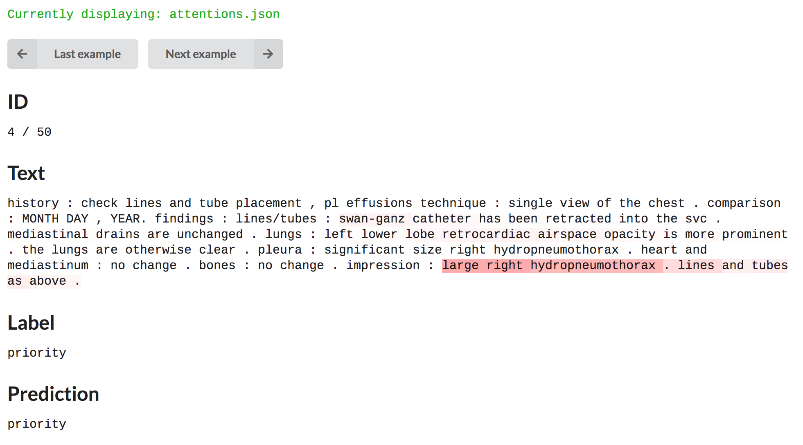

### What

A tool to visualize attention weights on a document, adapted from the [attention visualizer](https://github.com/abisee/attn_vis) by Abigail See. It looks like this when deployed:




### How

Run this in the root directory:

```  
python -m http.server
```

And go to `http://localhost:8000/` in your browser. Text and weights will be loaded from a `attentions.json` file, which contains a list of examples, with each example containing 4 fields:
- `words`: a list of words in the text being classified
- `weights`: a list of weights assigned to each word
- `label`: the gold label of the text
- `prediction`: the predicted label


